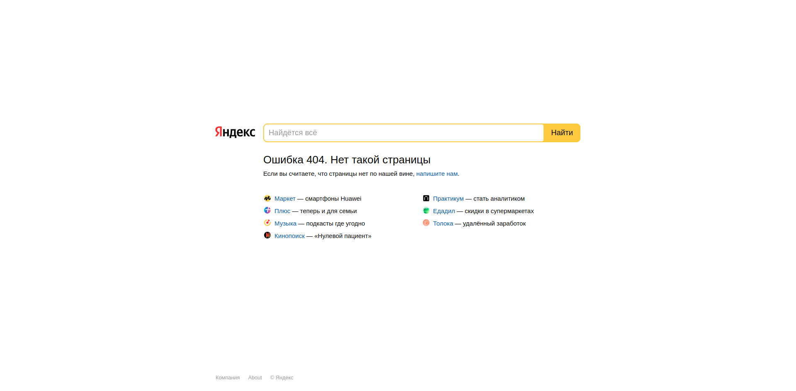

> Нужно сверстать страничку.  
> 
> На странице есть лого, поисковая строка (поле ввода и кнопка), заголовок, текст, список сервисов и футер. Основная > часть страницы центрируется по горизонтали и вертикали.  
> Подумайте:  
> 1. какие html-теги для каких элементов подойдут больше всего?
> 2. какие элементы - интерактивные и как должны реагировать на действия пользователя?
> 3. как сделать так, чтобы основная часть была по центру по вертикали и горизонтали на больших и маленьких размерах экрана?
> 4. а как сделать так, чтобы футер был прибит к низу экрана?
> 5. что должно быть, если тексты будут другими?  

### Ответы на вопросы
1. Я старался использовать семантические html-теги. Например: `section`, `article` и `nav`
2. Интерактивными являются поле вводе, кнопка и, возможно, ссылки (но я не уверен, можно ли их считать интерактивом)
3. Для позиционирования я использовал **flexbox** с его свойствами `align-items: center; justify-content: center`
4. Использовал `position: absolute; bottom: 0`
5. Наверное следует задать четкую ширину блоку. И тк у меня указан `display: flex`, то текст будет автоматически переноситься на новою строку
